# 🤖 AI Resume Generator

> **Intelligent Resume Tailoring System** powered by **Anthropic Claude** that automatically generates ATS-optimized resumes based on job descriptions.

[](https://python.org)
[](https://fastapi.tiangolo.com)
[](https://anthropic.com)
[](#phases)

## 🎯 **What This System Does**

This AI Resume Generator takes your existing experience, projects, and skills, then **intelligently tailors** them to match any job description you provide. It uses advanced AI to:

1. **Analyze Job Descriptions** → Extract keywords, requirements, and technologies
2. **Match Your Background** → Find relevant projects and experiences
3. **Generate Tailored Resumes** → Create ATS-optimized PDF resumes
4. **Optimize for ATS** → Ensure high compatibility with Applicant Tracking Systems

---

## 🔄 **Complete System Flow**

```mermaid
graph TD
    A[📄 Job Description Input] --> B[🧠 Claude AI Analysis]
    B --> C[🔍 Keyword Extraction]
    C --> D[📊 Semantic Matching]

    E[📁 Knowledge Base] --> F[🗂️ Projects Library]
    E --> G[💼 Work Experience]
    E --> H[🛠️ Skills Database]

    D --> I[⚖️ Relevance Scoring]
    F --> I
    G --> I
    H --> I

    I --> J[🎯 Smart Selection]
    J --> K[📝 Resume Generation]
    K --> L[📑 LaTeX Compilation]
    L --> M[📄 PDF Output]

    style A fill:#e1f5fe
    style B fill:#f3e5f5
    style M fill:#e8f5e8
```



### **🔍 Detailed Flow Breakdown:**

#### **Phase 1: Knowledge Base Loading**

```
📁 knowledge_base/
├── github_projects/     ← 25+ projects from your portfolio
├── work_experience/     ← Professional experience history
├── skills/             ← Technical skills organized by category
├── past_resumes/       ← Previous resume versions
├── templates/          ← LaTeX resume templates
└── profile_summary.json ← Personal information
```

**What Happens:**

1. System loads **25 GitHub projects** with extracted technologies
2. Imports **work experience** with achievements and responsibilities
3. Categorizes **technical skills** (Languages, Frameworks, Tools, etc.)
4. Validates all data using **Pydantic models** for type safety

#### **Phase 2: Job Analysis Engine**

```python
# User submits job description
POST /api/analyze-job
{
    "job_description": "We need a React developer with Node.js..."
}

# Claude AI processes the description
↓
# Extracts structured data:
{
    "required_skills": ["React", "Node.js", "JavaScript"],
    "preferred_skills": ["TypeScript", "AWS", "Docker"],
    "keywords": ["frontend", "API", "responsive"],
    "experience_level": "Mid-level",
    "industry_focus": "Technology",
    "company_name": "TechCorp"
}
```

**What Happens:**

1. **Claude AI** analyzes the job posting using advanced NLP
2. **Extracts keywords** using multiple pattern-matching techniques
3. **Identifies technologies** from a database of 80+ known tech stacks
4. **Determines experience level** and industry requirements
5. **Handles API failures** with intelligent fallback parsing

#### **Phase 3: Semantic Matching** _(Implemented)_

```python
# Sentence transformers convert text to vectors
job_vector = model.encode(job_requirements)
project_vectors = model.encode(project_descriptions)

# Cosine similarity calculates relevance scores
scores = cosine_similarity(job_vector, project_vectors)
# → [0.85, 0.72, 0.91, 0.45, ...]

# Top projects selected based on relevance
selected_projects = top_projects_by_score(scores, limit=4)
```

**What Happens:**

1. **Sentence transformers** convert job requirements to numerical vectors
2. **Project summaries** are converted to comparable vectors
3. **Cosine similarity** calculates relevance scores (0-1 scale)
4. **Smart selection** picks the 3-4 most relevant projects
5. **Technology overlap** increases project ranking

#### **Phase 4: Resume Generation** _(Future)_

```latex
% LaTeX template with dynamic content
\section{Experience}
\resumeSubHeadingListStart
  % Dynamically inserted based on job relevance
  \resumeProjectHeading
    {\textbf{ConnectX} $|$ \emph{React, Node.js, PostgreSQL}}{June 2024}
    \resumeItemListStart
      \resumeItem{Built real-time chat with Socket.io}
      \resumeItem{Implemented JWT authentication}
    \resumeItemListEnd
\resumeSubHeadingListEnd
```

**What Happens:**

1. **Template selection** based on job type and industry
2. **Dynamic content insertion** with most relevant projects
3. **Keyword optimization** to match job requirements
4. **LaTeX compilation** to professional PDF format
5. **ATS optimization** with proper formatting and keywords

---

## 🏗️ **System Architecture**

### **🧠 Core Components**

```
ai-resume-generator/
├── app/
│   ├── main.py              # 🚀 FastAPI application & API endpoints
│   ├── models/              # 📋 Pydantic data models
│   │   └── __init__.py      # (ProjectModel, ExperienceModel, etc.)
│   ├── services/            # 🔧 Business logic
│   │   └── resume_agent.py  # 🤖 Core AI agent with Claude integration
│   └── templates/           # 📄 LaTeX resume templates (future)
├── knowledge_base/          # 📚 Your personal data
├── tests/                   # 🧪 Comprehensive test suite
├── static/                  # 🌐 Web interface files (future)
├── output/                  # 📄 Generated resumes
└── requirements.txt         # 📦 Python dependencies
```

### **🔗 API Endpoints**

| Endpoint                      | Method | Purpose                             | Status     |
| ----------------------------- | ------ | ----------------------------------- | ---------- |
| `/`                           | GET    | Root endpoint with system info      | ✅         |
| `/health`                     | GET    | Health check and agent status       | ✅         |
| `/api/analyze-job`            | POST   | Analyze job description with Claude | ✅         |
| `/api/knowledge-base/summary` | GET    | View loaded projects/experience     | ✅         |
| `/api/generate-resume`        | POST   | Generate tailored resume            | 🔄 Phase 2 |
| `/api/resume/{id}/download`   | GET    | Download generated PDF              | 🔄 Phase 3 |

### **🧪 Data Models**

```python
# Job Analysis Output
class JobAnalysisModel(BaseModel):
    required_skills: List[str]
    preferred_skills: List[str]
    keywords: List[str]
    industry_focus: Optional[str]
    experience_level: Optional[str]
    technologies: List[str]
    company_name: Optional[str]

# Project Information
class ProjectModel(BaseModel):
    title: str
    summary: str
    technologies: List[str]
    github_url: Optional[str]
    relevance_score: Optional[float]

# Work Experience
class ExperienceModel(BaseModel):
    company: str
    position: str
    duration: Dict[str, str]
    description: List[str]
    technologies: List[str]
    achievements: List[str]
```

---

## 🚀 **Getting Started**

### **📋 Prerequisites**

- **Python 3.10+**
- **Anthropic API Key** ([Get one here](https://console.anthropic.com/))
- **Git** for cloning the repository

### **⚡ Quick Setup**

```bash
# 1. Clone the repository
git clone https://github.com/Dextron04/resume-agent.git
cd resume-agent

# 2. Navigate to the AI generator
cd ai-resume-generator

# 3. Run the automated setup script
./setup.sh

# 4. Configure your API key
cp .env.example .env
# Edit .env and add: ANTHROPIC_API_KEY=your_api_key_here

# 5. Pre-download AI models (prevents hanging)
python download_model.py

# 6. Start the API server
uvicorn app.main:app --reload
```

### **🔧 Manual Setup**

```bash
# Create virtual environment
python -m venv .venv
source .venv/bin/activate  # On Windows: .venv\Scripts\activate

# Install dependencies
pip install -r requirements.txt

# Set up environment
export ANTHROPIC_API_KEY="your_api_key_here"
export KNOWLEDGE_BASE_PATH="../knowledge_base"

# Run tests to verify setup
pytest tests/test_phase1.py -v

# Start the server
uvicorn app.main:app --reload --host 0.0.0.0 --port 8000
```

---

## 🧪 **Testing the System**

### **🌐 Interactive API Testing**

Open your browser to: **http://localhost:8000/docs**

### **📞 API Examples**

**Health Check:**

```bash
curl http://localhost:8000/health
```

**View Your Knowledge Base:**

```bash
curl http://localhost:8000/api/knowledge-base/summary
```

**Analyze a Job Description:**

```bash
curl -X POST "http://localhost:8000/api/analyze-job" \
  -H "Content-Type: application/json" \
  -d '{
    "job_description": "We are seeking a React developer with Node.js experience to build modern web applications. Must have experience with JavaScript, TypeScript, PostgreSQL, and AWS deployment."
  }'
```

**Expected Response:**

```json
{
  "analysis": {
    "required_skills": ["React", "Node.js", "JavaScript"],
    "preferred_skills": ["TypeScript", "PostgreSQL", "AWS"],
    "keywords": ["web applications", "modern", "developer"],
    "experience_level": "Mid-level",
    "technologies": [
      "React",
      "Node.js",
      "JavaScript",
      "TypeScript",
      "PostgreSQL",
      "AWS"
    ],
    "company_name": null
  },
  "status": "success"
}
```

### **🧪 Running Tests**

```bash
# Run all Phase 1 tests
pytest tests/test_phase1.py -v

# Run specific tests
pytest tests/test_phase1.py::TestPhase1::test_job_analysis_with_mock_anthropic -v

# Run with coverage
pytest tests/ --cov=app --cov-report=html
```

---

## 📊 **Development Phases**

### **✅ Phase 1: Core Foundation** _(Complete)_

- [x] **Knowledge Base Loading** - Import projects, experience, skills
- [x] **Claude AI Integration** - Job description analysis
- [x] **Technology Extraction** - Pattern matching from summaries
- [x] **FastAPI Backend** - RESTful API with documentation
- [x] **Comprehensive Testing** - 100% test coverage for core features
- [x] **Error Handling** - Graceful fallbacks and logging

### **🔄 Phase 2: Intelligent Matching** _(In Progress)_

- [ ] **Semantic Similarity Engine** - Vector-based project ranking
- [ ] **Smart Project Selection** - Choose top 3-4 relevant projects
- [ ] **Experience Filtering** - Select relevant work history
- [ ] **Keyword Optimization** - Maximize ATS compatibility
- [ ] **Relevance Scoring** - Quantify job-project alignment

### **🔮 Phase 3: Resume Generation** _(Planned)_

- [ ] **LaTeX Template System** - Professional resume layouts
- [ ] **Dynamic Content Insertion** - Job-specific customization
- [ ] **PDF Generation Pipeline** - High-quality output
- [ ] **Multiple Templates** - Industry-specific designs
- [ ] **ATS Optimization** - Maximum compatibility testing

### **🌟 Phase 4: Advanced Features** _(Future)_

- [ ] **Web Interface** - User-friendly frontend
- [ ] **Resume Versioning** - Track multiple versions
- [ ] **A/B Testing** - Compare different approaches
- [ ] **Analytics Dashboard** - Success rate tracking
- [ ] **Cover Letter Generation** - Matching cover letters

---

## 📈 **Current Capabilities**

### **✅ What Works Now:**

- **🧠 AI Job Analysis**: Claude analyzes any job description
- **📊 Knowledge Base**: 25+ projects and work history loaded
- **🔍 Technology Extraction**: 80+ technologies automatically detected
- **🚀 REST API**: Full documentation at `/docs`
- **🧪 Testing Suite**: Comprehensive test coverage
- **⚡ Performance**: Fast startup with model caching

### **📊 System Statistics:**

- **Projects Loaded**: 25 GitHub repositories
- **Work Experience**: 6 professional positions
- **Technologies Known**: 80+ frameworks and tools
- **API Response Time**: < 2 seconds for job analysis
- **Model Cache**: ~80MB sentence transformer model
- **Test Coverage**: 100% for Phase 1 features

---

## 🔧 **Configuration**

### **🌍 Environment Variables**

```bash
# Required
ANTHROPIC_API_KEY=your_anthropic_api_key_here

# Optional
KNOWLEDGE_BASE_PATH=../knowledge_base  # Path to your data
LOG_LEVEL=INFO                         # Logging verbosity
MODEL_CACHE_DIR=~/.cache/huggingface   # AI model storage
```

### **📁 Knowledge Base Structure**

```
knowledge_base/
├── github_projects/         # JSON files for each project
│   ├── 01_project_name.json
│   ├── 02_another_project.json
│   └── ...
├── work_experience/         # Professional experience
│   └── work_experience.json
├── skills/                  # Technical skills by category
│   └── skills.json
├── past_resumes/           # Previous resume versions
├── templates/              # LaTeX templates
└── profile_summary.json   # Personal information
```

---

## 🐛 **Troubleshooting**

### **❌ Common Issues & Solutions**

**Issue**: `ModuleNotFoundError: No module named 'sentence_transformers'`

```bash
# Solution: Install missing dependencies
pip install -r requirements.txt
```

**Issue**: Import hanging during startup

```bash
# Solution: Pre-download models
python download_model.py
```

**Issue**: `ANTHROPIC_API_KEY environment variable is required`

```bash
# Solution: Set your API key
export ANTHROPIC_API_KEY="your_key_here"
# Or add it to your .env file
```

**Issue**: Server not starting

```bash
# Solution: Check if port 8000 is available
lsof -i :8000
# Or use a different port
uvicorn app.main:app --port 8001
```

### **🔍 Debug Mode**

```bash
# Enable detailed logging
export LOG_LEVEL=DEBUG

# Run with Python debugger
python -m pdb -c continue -m uvicorn app.main:app --reload
```

---

## 📄 **License & Credits**

### **📜 License**

This project is licensed under the MIT License. See `LICENSE` file for details.

### **🙏 Acknowledgments**

- **Anthropic** for Claude AI capabilities
- **Hugging Face** for sentence transformer models
- **FastAPI** for the excellent web framework
- **LaTeX** community for resume templates

### **👨‍💻 Author**

**Tushin Kulshreshtha** - [GitHub](https://github.com/Dextron04)

---

## 🔄 **Contributing**

Contributions are welcome! Please feel free to submit a Pull Request.

### **🛠️ Development Setup**

```bash
# Fork the repository
git clone https://github.com/yourusername/resume-agent.git

# Create a feature branch
git checkout -b feature/amazing-feature

# Make your changes and test
pytest tests/ -v

# Commit and push
git commit -m "Add amazing feature"
git push origin feature/amazing-feature

# Open a Pull Request
```

---

## 📞 **Support**

- **📧 Issues**: [GitHub Issues](https://github.com/Dextron04/resume-agent/issues)
- **💬 Discussions**: [GitHub Discussions](https://github.com/Dextron04/resume-agent/discussions)
- **📖 Documentation**: [Project Wiki](https://github.com/Dextron04/resume-agent/wiki)

---

<div align="center">

**🎯 Ready to generate your perfect resume?**

[](./ai-resume-generator)
[](http://localhost:8000/docs)

_Transform your job applications with AI-powered resume tailoring!_

</div>
